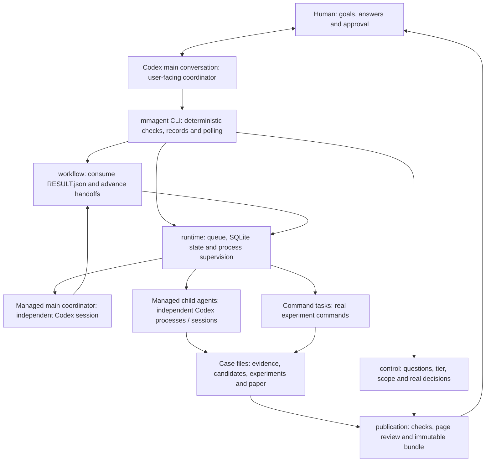
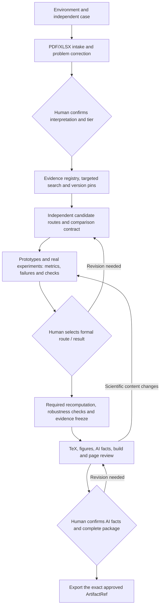

# MathModel Weave: Mathematical Modeling Multi-Agent Workbench

[中文 README](README.md) is the main entry point; this page provides the English counterpart.

This is the standalone `mathmodel-weave` product repository. Architecture research, source evidence, and fusion decisions live in the independent [research repository](https://github.com/SoFarSoGoodya/mathmodel-research); that repository is only a research document reference, not a runtime dependency.

## What makes it different

The product combines two layers:

1. **Modeling skills and process contracts** define how problem reading, data intake, literature evidence, candidate routes, experiments, review, paper writing, and AI-use disclosure are performed and handed off.
2. **A real multi-agent runtime** runs independent, permission-scoped tasks with session identity, persistent state, parallel exploration, and controlled commits. Multiple agents are managed tasks with traceable boundaries, not prompt variants in one chat.

Chinese mathematical modeling tools emphasize skills that guide individual stages, with less support for a recoverable multi-agent runtime. Examples include [MathModel-Skill](https://github.com/yushui2022/MathModel-Skill), [MathModelAgent](https://github.com/jihe520/MathModelAgent), and its derivative [MathMN](https://github.com/ShuoSachiko/MathMN). AI-for-math and applied-mathematics tools emphasize general agent coordination: [Danus](https://github.com/frenzymath/Danus) explores pure mathematics, while [ReasFlow](https://github.com/reaslab/ReasFlow) and [Station](https://github.com/dualverse-ai/station) support applied-mathematics research. A competition case additionally needs problem correction, route comparison, evidence freezing, and paper acceptance. This project studies all six and brings both layers into one case protocol, preserving open-ended exploration, external skill constraints, and human intervention.

## Six modules

| Layer                  | Module        | Responsibility                                                                             | Main artifacts                    |
| ---------------------- | ------------- | ------------------------------------------------------------------------------------------ | --------------------------------- |
| Runtime and governance | `runtime`     | Launch managed tasks, persist process/session state, and perform bounded recovery          | task state, events, attempts      |
| Runtime and governance | `control`     | Record permissions, research tier, human questions, and decisions                          | decisions, permissions, approvals |
| Skill and process      | `evidence`    | Ingest PDF/XLSX, correct the problem statement, manage evidence, and freeze cited versions | source text, registry, freeze     |
| Skill and process      | `exploration` | Produce independent candidate routes and comparison contracts                              | candidates, comparisons           |
| Skill and process      | `execution`   | Run declared code and inputs, recording metrics, failures, and checks                      | manifests, metrics, checks        |
| Skill and process      | `publication` | Assemble figures, TeX, references, AI-use details, and exact release bundles               | paper, figures, release bundle    |

The runtime layer answers who runs with which permissions and how state resumes. The skill layer answers how each modeling step is performed and accepted. They exchange case-relative files, manifests, checks, and human decisions.



The user-facing conversation explains the work and operates existing CLI commands. The managed `main` task plans and dispatches work in its own provider session. `workflow` is deterministic handoff code: it reads that task's `RESULT.json`, checks authorization and human decisions, waits for dependencies or answers, then continues the same managed session. There is no additional resident chat service or file watcher.

## Choosing fast / standard / full

The tiers express the desired research depth. This table guides your agreement with the coordinator; route counts, experiment scope, stopping conditions, and budget need a problem-specific explanation and human confirmation.

| Tier | Suitable cases | Focus and usual deliverables | Tradeoff |
| --- | --- | --- | --- |
| `fast` | Familiar methods, practice, limited time, initial feasibility | Targeted evidence gaps, a real baseline or prototype, interpretable results and an issue list | Narrower comparison and validation; prototypes need review before formal adoption |
| `standard` | Ordinary modeling projects with connected research, computation and writing | Candidate routes, a fair comparison contract, experiments, targeted recomputation/robustness checks, and a paper package for review | Effort depends on the problem; a recommendation still needs explicit approval |
| `full` | Open questions, many external facts, disputed routes, deeper research | Broader literature, methods, counterexamples and citation tracing, independent routes, necessary recomputation, sensitivity and failure analysis | Potentially higher time and cost; search and mathematical verification remain bounded |

All tiers retain real evidence, actual execution, failure records, human decisions and final package approval. The evidence skill calls for stopping when a gap closes, the time limit is reached, or new findings have low value; deeper research should converge after two rounds without high-value additions.

`ask-tier` displays the problem path/hash and the selected profile's `model/effort`; after approval, `start` checks that the tier, problem and profile have not changed. Same-named profiles in `case.toml` are concrete model settings. Historical model names in examples need local verification or adjustment. Selecting a tier does not discover or install models, and no fixed route count, token budget or spending cap is built in. Research `scope/bounds` checks govern work authorization separately from Codex sandbox, network and writable-directory settings.

## Quick start

The author's development and usage environment is WSL2 + Ubuntu 24 LTS + Codex CLI; native Windows support remains future work. You need bash/zsh, Python 3.12+, `uv` and a working Codex CLI. Paper output also needs XeLaTeX, latexmk, CTeX/xeCJK, CJK fonts, BibTeX and Poppler. New users do not need to learn the CLI first:

1. Open a Codex main conversation that can access the local repository. Background execution still needs Codex CLI. If your account actually offers Luna, Luna/medium is an option for everyday guidance; it is not a standard Codex entitlement or a required model for every modeling task.
2. Send this short prompt:

    > Read `AGENTS.md` and `docs/guide.md`, check my environment and guide me through a new problem. Run commands, manage background agents and record state; I will provide files, answer questions and confirm decisions in this main conversation.

3. Answer the coordinator's questions, provide the problem files, choose a research tier, and confirm the problem statement. The coordinator continues the managed work and asks when a human decision is required.

Developers who prefer the CLI can run:

```bash
uv sync --locked
uv run mmagent doctor
uv run mmagent init CASE
```

See [setup](docs/setup.md) and the [CLI reference](docs/cli.md) for configuration, optional MinerU/OCR preprocessing, and troubleshooting. Built-in PDF/XLSX intake uses `pypdf` and `openpyxl`; this release has no MinerU SDK adapter.

## From problem to submission package



This describes work organization; the problem and approved scope determine the tasks. Code does not enforce a fixed stage count or reviewer-role chain for every case.

| Stage | Input | Work | Output and human confirmation |
| --- | --- | --- | --- |
| Environment and case | Local tools, independent case path | Check tools with `doctor`; initialize directories and credential-free config | Environment gaps and `case.toml`; humans handle login, administrator actions and model settings |
| Problem and data | Separate PDF/XLSX paths | Extract page-marked text, inspect every sheet programmatically, record uncertain regions | Faithful problem text, data profile and conversion checks; humans correct ambiguity and explicitly choose a tier |
| Evidence | Problem, specific evidence gaps, official rules | Register source identity, locators and access limits; pin adopted versions | Original content, notes, registry and later freeze; confirm important interpretation or scope changes |
| Route exploration | Corrected problem, evidence, human ideas | Propose independent candidates with assumptions, methods, tradeoffs and verification conditions; define comparison first | `candidates/`, `comparisons/`; humans select formal routes; a fusion remains a new unreviewed candidate |
| Experiments and review | Selected inputs, code/config, metrics and comparison contract | Run code; preserve instances/observations, failure denominators, units, checks and environment; recompute and test robustness as needed | Run manifest, metrics, checks and comparison evidence; humans confirm adopted results; authorized ordinary iterations may continue |
| Paper and freeze | Exact selected result, evidence freeze, current rules, writing material | Generate result tables/macros and figures, assemble TeX, build PDF and inspect every page | PDF, TeX, figure index, page images and build report; scientific changes return to experiments/result confirmation |
| Disclosure and export | Adopted task records, complete immutable package | Join task/model/effort records with real human adoption, modifications and verification; check bundle identity | Humans confirm AI facts, then approve the exact complete package; export does not submit it to a competition |

Compute and preserve evidence before writing selected scientific results into the paper. Passing machine checks means the declared checks passed; completed page review still requires final human approval.

## Human collaboration

Use the Codex main conversation as the single entry point. You describe goals, answer questions, and make decisions. The coordinator checks configuration, initializes cases, starts and manages background agents, retries or resumes interrupted work according to project rules, reads current state, and explains decisions in plain language. You do not need to remember agent names or repeatedly run CLI commands.

At the start of a case, send the short prompt above. Then confirm the problem statement, choose a research tier, and approve or reject candidate routes. The coordinator handles experiments, state persistence and bounded recovery; you confirm the final route, results, AI-use disclosure and release package. A new main conversation can take over by reading repository docs and case state. Resuming old tasks on another device additionally requires the complete case, original absolute paths and accessible provider conversation history; a session ID cannot reconstruct lost history. See [developer handoff](docs/dev.md), [中文开发交接](docs/zh/dev.md) and [setup](docs/setup.md).

If you edit a case Markdown file, tell the coordinator: “I updated the file; please read the latest content.” Keep credentials and model settings in Codex configuration, never in the repository or case files.

## How multiple agents actually run

These mechanisms belong to the runtime; users can leave command operation to the coordinator:

1. The assistant records tasks through `start` / `submit`. Each has a distinct `task_id`, declared inputs and workspace. Selected inputs, instructions and skills are copied into its input area; model and execution policy are captured as a snapshot.
2. The `serve` process supervisor takes queued tasks. Agent tasks launch independent `codex exec --json` processes; deterministic work such as experiments uses `command` tasks. By default, **2 local slots** are shared by the managed main, child agents and command tasks; case configuration can change that count.
3. The provider's `thread_id` becomes the task's session identity. A task can have multiple attempts, each with a new run ID, PID/process group, start/end state, `events.jsonl` and `stderr.log`. Records live in `.runtime/state.sqlite` and task directories.
4. The managed coordinator ends a turn with `RESULT.json`, declaring `requests`, `wait_for` and `deliverables`, and optionally human questions. Ending the turn frees the model slot; waiting for a person does not require ongoing model calls.
5. The outer assistant advances handoffs with `workflow poll`: validate authorization, submit requests once, wait for child tasks and human decisions, then continue the same coordinator session with bounded summaries. `serve` supervises processes; `workflow poll` advances handoffs.
6. Deliverables enter task staging first. Manifest/hash validation and a serial publication lock move them into content-addressed immutable bundles. Formal route, result, fusion and final package selections remain bound to the exact human-approved objects.

Transient network/rate-limit failures receive bounded retries in the same session: main gets at most 1 automatic retry, child at most 2; the child's second retry waits at least 300 seconds and honors a longer `Retry-After`. Missing an observed session ID, a non-transient error or exhausted retries causes a visible pause. Command tasks do not use the agent network-retry policy.

After restart, the supervisor reconciles saved process identities, events and states, including surviving or finished attempts; timeout and cancellation terminate process groups. If original provider history is unavailable after migration, the assistant should create a new task from preserved artifacts rather than claim an old session resumed. Changes to the problem or approved model/profile require renewed confirmation. Research `scope` governs work authorization; separate task directories do not themselves provide OS isolation. Codex configuration supplies sandbox, network and writable-directory controls.

## Directory layout

The product ships reusable capabilities. Problem files and runtime data belong in a separately managed case. Product entries below are tracked repository contents.

```text
mathmodel-weave/
├── README.md / README.en.md       # Chinese main entry and English counterpart
├── AGENTS.md                     # Codex project instructions
├── mathmodel_agent/              # CLI and runtime code
│   ├── runtime/                  # Tasks, sessions, attempts and bundle publishing
│   ├── evidence/ execution/ publication/
│   └── control.py exploration.py workflow.py
├── skills/                       # Coordination, evidence, exploration, execution, review, paper
├── config/                       # Credential-free case configuration example
├── templates/                    # TeX and publication styles
├── examples/                     # Synthetic experiment and paper demonstrations
├── docs/                         # guide / setup / cli / design / dev / status
│   ├── modules/                  # Module interfaces and behavior
│   └── zh/                       # Chinese topic docs and developer handoff
├── tests/                        # Existing validation cases
├── pyproject.toml / uv.lock      # Python project and locked dependencies
└── LICENSE / NOTICE.md / licenses/ # Licensing and third-party notices

Separately managed CASE/
├── case.toml                     # Case settings, no credentials
├── human/ problem/ datasets/     # Answers, coordinator/control records, problem and data
├── sources/ knowledge/ freezes/  # Sources, knowledge and adopted evidence snapshots
├── candidates/ comparisons/     # Routes and comparison contracts
├── tasks/ artifacts/ paper/      # Workspaces, immutable artifacts and paper
└── .runtime/                     # SQLite state, publication lock and receipts
```

Developer maintenance resumes from repository files, without requiring this conversation or an old session. For a new system, read [docs/dev.md](docs/dev.md) / [docs/zh/dev.md](docs/zh/dev.md) first. Case backups and provider history are separate migration objects.

## Documentation

- [User guide](docs/guide.md)
- [Setup](docs/setup.md) · [CLI](docs/cli.md)
- [Design](docs/design.md) · [Developer handoff](docs/dev.md)
- [Status](docs/status.md) · [Origins](docs/origins.md)
- [Module notes](docs/modules/)
- [Chinese topic docs](docs/zh/)

`skills/` contains process contracts, `mathmodel_agent/` contains runtime code, `templates/` contains publication templates, and `examples/` contains synthetic demonstrations. Research records, upstream checkouts, and downloaded skill packages are not required to run or develop this repository.

## Sources and license

[Danus](https://github.com/frenzymath/Danus), [ReasFlow](https://github.com/reaslab/ReasFlow), [Station](https://github.com/dualverse-ai/station), [MathModelAgent](https://github.com/jihe520/MathModelAgent), [MathMN](https://github.com/ShuoSachiko/MathMN), and [MathModel-Skill](https://github.com/yushui2022/MathModel-Skill) are independent projects that this product respects and studies. Their mechanisms informed role coordination, recovery, modeling process, evidence handling, and publication constraints; this repository defines its own interfaces and does not silently copy or inherit upstream licenses. See [docs/origins.md](docs/origins.md), [LICENSE](LICENSE), [NOTICE.md](NOTICE.md), and [licenses/](licenses/).

| Source | Main inspiration | Product location |
| --- | --- | --- |
| [Danus](https://github.com/frenzymath/Danus) | Independent workers, role-specific tools, validation before writes | `runtime/`, `control.py` |
| [ReasFlow](https://github.com/reaslab/ReasFlow) | Specialist session identity, handoffs and knowledge cards | `runtime/`, `workflow.py`, evidence knowledge directories |
| [Station](https://github.com/dualverse-ai/station) | Parallel reasoning, a single writer, isolation ideas, recovery and human pauses | Task workspaces, publication lock, runtime and control |
| [MathModelAgent](https://github.com/jihe520/MathModelAgent) | Staged problem reading, modeling, coding and writing | `skills/` and module documentation |
| [MathMN](https://github.com/ShuoSachiko/MathMN) | Evidence ledgers, route mapping, literature research and traceable handoffs | Evidence/exploration skills, source and candidate records |
| [MathModel-Skill](https://github.com/yushui2022/MathModel-Skill) | Structured problem statements, candidate comparison, recomputation, robustness and publication gates | `skills/`, execution/publication and templates |

This maps mechanism origins, rather than claiming adoption of entire upstream protocols, platforms or feature sets. This product's three tiers combine work agreements with authorization/profile binding; they are not upstream Lite/Flash/Standard/Pro branches. The research repository preserves fuller version, evidence-level and tradeoff records. Runtime and future maintenance do not require old research conversations, upstream checkouts or downloaded skill packages.

## Implemented capabilities and current limits

Code covers file-based cases, CLI lifecycle, independent Codex/command tasks, persistent state, bounded retries, human decisions, evidence registration/freezing, candidate comparison, experiment manifests, and TeX/PDF build, review records and exact bundle export. [ACCEPTANCE.md](ACCEPTANCE.md) preserves basic-flow and synthetic-demonstration evidence; it does not establish a complete real-competition run.

| Boundary | Current behavior / improvement direction |
| --- | --- |
| Models and external tools | Basic acceptance did not establish every live provider, MCP, Exa or zvec-grep integration; check local configuration, and verify example model names |
| Platform and migration | Linux/WSL is the current target; native Windows, relocation of absolute case paths and session recovery without history are not established capabilities |
| PDF/XLSX | `pypdf` reads embedded text and `openpyxl` inspects workbooks; scans need external OCR/MinerU, and formula text/cache is not recalculation |
| Figures and papers | The first renderer targets a synthetic allocation example; new scientific figures need task-specific renderers, and generated page images still need actual inspection and review records |
| Export formats | Chinese XeLaTeX/PDF plus supporting files; no built-in DOCX/LibreOffice, DrawIO, Plotly/Chrome or fixed reviewer-role chain |
| Rules and quality | Recheck and freeze current year/regional rules per case; local checks are not mathematical proofs, award guarantees or automatic competition submission |

Further work centers on live integration evidence, platform support and problem-specific capabilities; see [status](docs/status.md) for priorities. Research depth, concurrency slots, process sandbox and spending budget are distinct dimensions; material changes need explanation and confirmation.

Examples use synthetic data and are not competition submissions.
