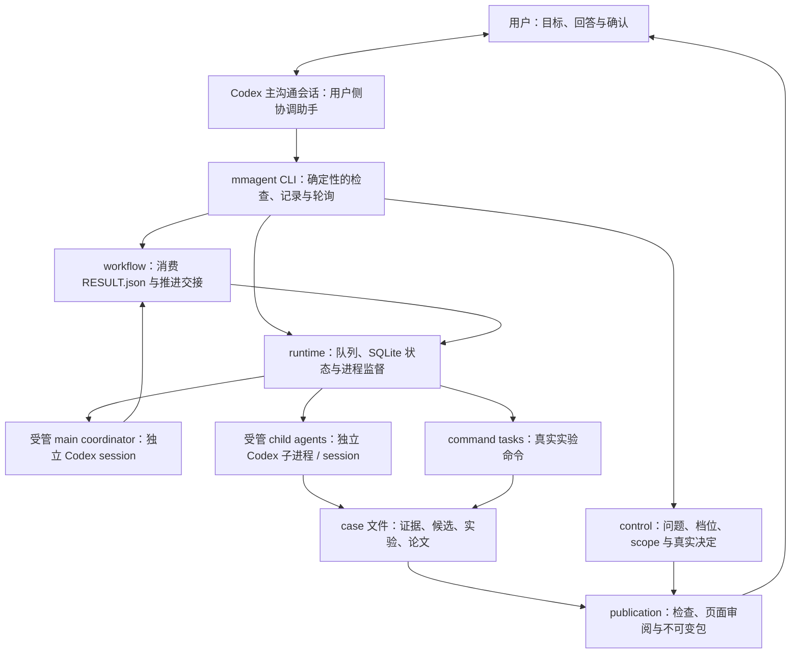
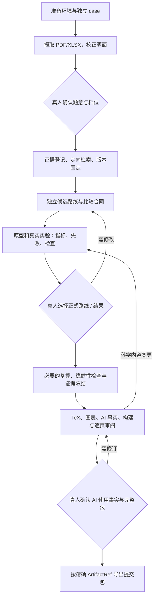

# MathModel Weave：数学建模多智能体工作台

中文是本项目的主要使用入口；[English README](README.en.md) 提供同等内容的英文说明。

本产品仓库是一个可独立运行的数学建模工作台。对应的框架逆向分析、来源证据和融合决策保存在独立的[研究仓库](https://github.com/SoFarSoGoodya/mathmodel-research)；研究仓库不属于运行依赖。

## 项目特点

本项目同时提供两层能力：

1. **建模 skill 与流程层**：把读题、数据整理、文献证据、候选路线、实验、审阅、论文和 AI 使用披露组织成有明确输入输出的步骤。它约束应该检查什么、产物如何交接，以及哪些事项必须由人确认。
2. **真实的多 agent 运行时层**：用独立任务、权限范围、会话身份、持久状态、并行探索和受控提交来运行多个 agent。不同 agent 不是同一个聊天窗口里换几段提示词，而是拥有可追踪边界的受管任务。

中文数学建模领域的工具主要集中在 skill 流程上，给出了不同建模阶段的明确约束与操作指导，但较为缺乏可恢复的多 agent 协作运行时，典型例子包括 [MathModel-Skill](https://github.com/yushui2022/MathModel-Skill)、[MathModelAgent](https://github.com/jihe520/MathModelAgent) 以及基于 MathModelAgent 开发的 [MathMN](https://github.com/ShuoSachiko/MathMN)。而 AI for Math/应用数学领域的工具主要提供通用的 agent 编排，例如主攻纯数学多 agent 协作探索的 [Danus](https://github.com/frenzymath/Danus)、应用数学科研的 [ReasFlow](https://github.com/reaslab/ReasFlow) 和 [Station](https://github.com/dualverse-ai/station)，但针对特定的建模比赛项目，往往缺乏所需的题意校正、路线比较、证据冻结和论文验收。本项目深度挖掘并参考了这六个项目，把两层能力放在同一套 case 协议中，同时保留 agent 探索层面的自由开发，以及流程层面的 skill 外部约束和人类决策与介入。

## 六大模块

| 层           | 模块          | 作用                                                        | 主要产物                       |
| ------------ | ------------- | ----------------------------------------------------------- | ------------------------------ |
| 运行时与治理 | `runtime`     | 启动受管任务、保存会话与进程状态、处理有限恢复              | task state、事件日志、attempt  |
| 运行时与治理 | `control`     | 记录权限、研究档位、人工问题与决定，设置明确的人为门槛      | decision、permission、approval |
| skill 与流程 | `evidence`    | 导入 PDF/XLSX，校正题面，维护文献和数据证据，冻结可引用版本 | source text、registry、freeze  |
| skill 与流程 | `exploration` | 生成独立候选路线，定义比较合同，支持开放式多路径探索        | candidate、comparison          |
| skill 与流程 | `execution`   | 按声明的输入和命令运行代码，记录指标、失败和检查结果        | run manifest、metrics、checks  |
| skill 与流程 | `publication` | 组织图表、TeX、参考文献、AI 使用详情并生成精确发布包        | paper、figures、release bundle |

运行时层负责“谁在什么权限下运行、状态如何恢复”；skill 层负责“数学建模工作的每一步如何完成和验收”。两层通过 case-relative 文件、manifest、检查结果和人工决定交接。



图中的主沟通会话与受管 `main` 任务有不同职责：前者向用户解释并操作已有 CLI，后者在独立 provider session 中规划和派发建模任务。`workflow` 是确定性的交接代码；它读取受管 coordinator 的 `RESULT.json`，检查权限和人工决定，等待子任务或真人回答后，再续接同一个受管 session。产品没有额外常驻聊天服务或文件监听器。

## 快速开始

作者的开发与使用环境是 WSL2 + Ubuntu 24 LTS + Codex CLI；原生 Windows 适配仍待开发。需要 bash/zsh、Python 3.12+、`uv` 和可用的 Codex CLI；论文阶段还需要 XeLaTeX、latexmk、CTeX/xeCJK、中文字体、BibTeX 和 Poppler。没有使用经验时，不必先学习命令行：

1. 打开能访问本机仓库的 Codex 主沟通会话。后台执行仍依赖 Codex CLI。若账号实际提供 Luna，可选择 Luna/medium 做日常引导；它不是 Codex 标配，也不要求所有建模任务都使用同一模型。
2. 把下面这段提示词发给 Codex：

    > 请读 `AGENTS.md` 和 `docs/zh/guide.md`，检查环境并引导我开始新题；你负责运行命令、管理后台 agent 和记录状态，我只在主会话提供文件、回答问题和确认决定。

3. 按助手的提问提供题目文件、选择研究档位并确认题面。助手会继续安排后台工作，遇到必须由人决定的路线、结果或发布事项时再询问你。

熟悉命令行的开发者也可以直接运行：

```bash
uv sync --locked
uv run mmagent doctor
uv run mmagent init CASE
```

手动命令、配置文件、MinerU 外部预处理和故障处理见 [环境配置](docs/setup.md) 与 [命令参考](docs/cli.md)。内置 PDF/XLSX 读取使用 `pypdf` 和 `openpyxl`；扫描 PDF 可先用外部 OCR 或 MinerU 处理，本产品当前不包含 MinerU SDK 适配器。

## fast / standard / full 怎么选

三档表示希望投入的研究深度。下表是与协调助手约定工作的选档指南，具体路线数、实验范围、停止条件和预算须按题目说明并由人确认。

| 档位 | 适用场景 | 工作重心与通常交付 | 应接受的取舍 |
| --- | --- | --- | --- |
| `fast` | 熟悉方法、练习题、时间紧，先判断路线可行性 | 定向填补关键证据缺口，尽快运行基线或原型，留下可解释的结果和问题清单 | 比较与验证覆盖较窄；原型不能自动视为正式结果 |
| `standard` | 常规建模项目，希望研究、计算和论文衔接完整 | 形成候选路线和公平比较合同，运行实验与针对性复算/稳健性检查，准备可审阅论文包 | 工作量随题目变化；可推荐，但必须由用户明确批准 |
| `full` | 开放问题、外部事实多、路线争议大，愿意投入更深研究 | 扩展文献、方法、反例和引用追踪，增加独立路线及必要的复算、敏感性与失败分析 | 成本与时间可能更高；不代表穷尽搜索或数学正确性保证 |

任何档位都保留真实证据、实际执行、失败记录、人工决定和最终包批准。证据 skill 要求按缺口检索，在缺口关闭、时限到达或新增价值降低时停止；深入研究连续两轮没有高价值补充时应收敛。

实现上，`ask-tier` 展示题面路径/hash 和该档 profile 的 `model/effort`；用户批准后，`start` 校验档位、题面和 profile 未变。`case.toml` 中同名 profile 是具体模型配置，示例中的历史模型名需要用户在本机核实或调整。选档不会发现或安装模型，也没有内置固定路线数量、token 硬预算或自动消费上限。研究授权 `scope/bounds` 是工作范围检查，与 Codex 的进程 sandbox、网络和写目录配置分别生效。

## 从题目到提交包



这是工作组织图，具体任务由题目和已授权范围决定；代码没有强制所有项目使用固定阶段数量或固定审稿角色链。

| 阶段 | 输入 | 工作 | 输出与人工确认 |
| --- | --- | --- | --- |
| 环境与 case | 本机工具、独立 case 路径 | `doctor` 检查工具，初始化目录与无密钥配置 | 环境缺口、`case.toml`；登录、管理员操作和模型配置由真人处理 |
| 题面与数据 | 独立的 PDF/XLSX 路径 | 提取带页码文本，程序检查所有工作表，记录不确定区域 | 忠实题面、数据概况与转换检查；真人校正歧义并明确选档 |
| 证据 | 题面、具体证据缺口、官方规则 | 登记来源身份、内容定位和访问限制，固定实际采用的版本 | 原文、notes、来源登记与后续 freeze；重要解释或范围变化须确认 |
| 路线探索 | 校正题面、证据、用户想法 | 独立提出候选；声明假设、方法、取舍和可验证条件，先定义比较合同 | `candidates/`、`comparisons/`；真人选择正式路线，融合方案仍是待审新候选 |
| 实验与审阅 | 选定输入、代码/config、指标与比较合同 | 真实运行，保存样本/观测、失败分母、单位、检查和环境；按需复算与稳健性分析 | run manifest、metrics、checks、比较证据；真人确认采用结果，范围内迭代可连续执行 |
| 论文与冻结 | 精确选定结果、证据 freeze、当年规则、写作材料 | 生成结果表/宏与图表，组织 TeX，构建 PDF 并逐页审阅 | 论文 PDF、TeX、图表索引、页面图和构建报告；科学内容变更返回实验/结果确认 |
| 披露与导出 | 实际采用的任务记录、完整不可变包 | 汇合任务/model/effort 与人类采纳、修改、核验事实，检查包身份 | 真人先确认 AI 使用事实，再批准精确完整包；批准后导出，不代替用户向赛事提交 |

先计算和留证，再把已选定的科学结果写入论文。机器检查通过只表示约定的检查通过；页面审阅完成也仍需要最终真人批准。

## 人机协作

把 Codex 主会话当作唯一入口即可。你负责说明目标、回答问题和作出决定；协调助手负责检查配置、初始化 case、启动和管理后台 agent、在断流或中断后按规则重试/恢复、读取最新状态，并把需要你确认的内容用自然语言说清楚。你不需要记住后台 agent 的名称，也不需要手动反复执行 CLI 命令。

开始新题时，先发送上面的短提示词。之后按顺序完成三件事：确认题面文字，选择研究档位，批准或否决候选路线。实验迭代、状态保存和可恢复运行由助手处理；最终路线、结果、AI 使用说明和发布包仍由你确认。新主会话可以读取仓库文档和 case 状态接手；换设备恢复旧任务还要求完整 case、原绝对路径与可用的 provider 对话历史，session ID 不能重建丢失的对话。具体见 [中文开发交接](docs/zh/dev.md) 和 [环境配置](docs/zh/setup.md)。

如果你直接编辑了 case 中的 Markdown，只需告诉助手“我已更新文件，请读取最新内容”。账号密钥和模型配置由 Codex 管理，不要写进仓库或 case 文件。

## 多 agent 如何真实运行

这些机制属于本产品运行时，不要求用户直接操作命令：

1. 助手通过 `start` / `submit` 将任务写入 case。每个任务有独立 `task_id`、声明的输入和工作目录；选定的输入、指令和 skill 被复制到任务输入区，模型与执行策略以快照记录。
2. `serve` 的进程监督器从队列取任务。agent 任务启动独立的 `codex exec --json` 子进程；实验等确定性工作使用 `command` 任务。默认 **2 个 local slots** 由受管 main、child agents 和 command tasks 共享，可在 case 配置中调整。
3. provider 返回的 `thread_id` 成为该任务的 session 身份。一个 task 可以有多次 attempt；每次 attempt 都有新的 run ID、PID/进程组、开始结束状态、`events.jsonl` 与 `stderr.log`，记录保存在 `.runtime/state.sqlite` 和任务目录中。
4. 受管 coordinator 在一轮结束时写 `RESULT.json`，声明 `requests`、`wait_for`、`deliverables`，也可提出人工问题。结束当前轮会释放模型槽位；它不会为了等真人而持续调用模型。
5. 外层助手运行 `workflow poll` 推进交接：检查授权后提交尚未提交的请求，等待子任务与真人决定，再用有界结果摘要续接同一个 coordinator session。`serve` 管进程，`workflow poll` 管交接，两者职责不同。
6. 产物先放在任务 staging 区，经 manifest/hash 校验和串行发布锁进入内容寻址的不可变 bundle；正式路线、结果、融合方案及最终论文包的选择仍绑定真人批准的精确对象。

短暂网络/限流等失败仅作有限同 session 重试：main 最多自动重试 1 次，child 最多 2 次，child 第 2 次等待至少 300 秒，并尊重更长的 `Retry-After`。没有已观察到的 session ID、非瞬态失败或重试耗尽时暂停并报告；命令任务也不会套用 agent 的网络重试策略。

监督器重启会核对保存的进程身份、事件和状态，处理仍存活或已结束的 attempt；超时与取消按进程组终止。迁移后若原 provider history 不可用，助手应从已保存产物建立新任务接续，不能冒充旧 session 续跑。题面或已批准模型/profile 变化须重新确认。研究 `scope` 是工作授权边界，独立任务目录也不等于 OS 隔离；实际 sandbox、网络和写目录限制由 Codex 配置承担。

## 目录结构

产品仓库只交付通用能力，题目与运行数据另存于用户管理的 case；下列产品目录均为实际跟踪的内容。

```text
mathmodel-weave/
├── README.md / README.en.md       # 中文主入口与英文说明
├── AGENTS.md                     # Codex 项目操作入口
├── mathmodel_agent/              # CLI 与运行时代码
│   ├── runtime/                  # task / session / attempt 与产物发布
│   ├── evidence/ execution/ publication/
│   └── control.py exploration.py workflow.py
├── skills/                       # 协调、证据、探索、执行、审阅、论文约束
├── config/                       # 无密钥 case 配置示例
├── templates/                    # TeX 与论文样式模板
├── examples/                     # 合成实验与论文演示
├── docs/                         # guide / setup / cli / design / dev / status
│   ├── modules/                  # 模块接口与行为
│   └── zh/                       # 中文专题与开发交接
├── tests/                        # 已有验证用例
├── pyproject.toml / uv.lock      # Python 项目与锁定依赖
└── LICENSE / NOTICE.md / licenses/ # 许可与第三方告知

用户另存的 CASE/
├── case.toml                     # 该题配置，不含密钥
├── human/ problem/ datasets/     # 问答、协调/控制记录、题面与数据
├── sources/ knowledge/ freezes/  # 来源、知识与采用的证据快照
├── candidates/ comparisons/     # 路线与比较合同
├── tasks/ artifacts/ paper/      # 工作区、不可变产物与论文
└── .runtime/                     # SQLite 状态、发布锁与收据
```

开发维护应从仓库文件恢复，不依赖本轮主会话或任何旧 session。迁移开发环境请先读 [docs/zh/dev.md](docs/zh/dev.md) / [docs/dev.md](docs/dev.md)；case 备份与 provider history 是不同的迁移对象。

## 文档导航

- [用户指南](docs/zh/guide.md)：第一次使用、交题、确认和恢复。
- [环境配置](docs/zh/setup.md)：依赖、模型、MCP、TeX 和可选预处理。
- [命令参考](docs/zh/cli.md)：命令行输入输出和示例。
- [设计说明](docs/zh/design.md)：分层架构、数据流和状态边界。
- [开发交接](docs/zh/dev.md)：换设备后从零恢复并继续开发。
- [当前状态](docs/zh/status.md)：已验证能力、限制和后续入口。
- [来源与借鉴](docs/zh/origins.md)：六个来源体系、采用机制和许可边界。
- [模块说明](docs/zh/modules/)：六大模块的接口和行为。
- 中文专题文档位于 [docs/zh](docs/zh/)。

目录中的 `skills/` 是流程约束与任务说明，`mathmodel_agent/` 是运行时代码，`templates/` 是论文和发布模板，`examples/` 是合成示例。研究记录、上游源码和下载的 skill 包不是运行或开发前提。

## 来源与许可

本项目尊重并研究了 [Danus](https://github.com/frenzymath/Danus)、[ReasFlow](https://github.com/reaslab/ReasFlow)、[Station](https://github.com/dualverse-ai/station)、[MathModelAgent](https://github.com/jihe520/MathModelAgent)、[MathMN](https://github.com/ShuoSachiko/MathMN) 和 [MathModel-Skill](https://github.com/yushui2022/MathModel-Skill) 六个独立项目。它们提供了可借鉴的角色协作、会话恢复、建模流程、证据管理和论文约束；本仓库重新实现自己的接口，不默示复制或继承上游许可证。来源映射见 [docs/origins.md](docs/origins.md)，法律条款见 [LICENSE](LICENSE)、[NOTICE.md](NOTICE.md) 和 [licenses/](licenses/)。

| 来源体系 | 主要借鉴 | 本产品对应位置 |
| --- | --- | --- |
| [Danus](https://github.com/frenzymath/Danus) | 独立 worker、按角色限定工具、校验后再写入 | `runtime/`、`control.py` |
| [ReasFlow](https://github.com/reaslab/ReasFlow) | 专家 session 身份、任务交接与知识卡片 | `runtime/`、`workflow.py`、证据知识目录 |
| [Station](https://github.com/dualverse-ai/station) | 并行推理、单写者提交、隔离思路、恢复和人工暂停 | 任务工作区、产物发布锁、运行时与控制层 |
| [MathModelAgent](https://github.com/jihe520/MathModelAgent) | 读题、建模、代码到论文的阶段流程 | `skills/` 与模块文档 |
| [MathMN](https://github.com/ShuoSachiko/MathMN) | 证据台账、路线映射、文献研究与可追踪交接 | evidence / exploration skill 与来源、候选记录 |
| [MathModel-Skill](https://github.com/yushui2022/MathModel-Skill) | 结构化题面、候选比较、复算和稳健性检查、论文门槛 | `skills/`、execution / publication、模板 |

这是机制来源映射，不代表原样移植上游协议、平台或全部功能。这里的三档属于本产品的工作约定与授权/profile 绑定，不等于上游的 Lite/Flash/Standard/Pro 分支。研究仓库保留更完整的版本、证据等级与取舍，产品运行和后续开发不需要旧研究会话、上游 checkout 或下载的 skill 包。

## 已实现与当前边界

已有代码覆盖文件式 case、CLI 生命周期、独立 Codex/命令任务、持久化状态、有限重试、人工决定、证据登记与冻结、候选比较、实验 manifest，以及 TeX/PDF 的构建、审阅记录和精确包导出。[ACCEPTANCE.md](ACCEPTANCE.md) 保存基础流程与合成演示的验收证据；它不等于真实竞赛的完整实战验收。

| 边界 | 当前行为 / 后续改进方向 |
| --- | --- |
| 模型与外部工具 | 基础验收未证明所有真实 provider、MCP、Exa 或 zvec-grep 链路；按本机实际配置检查，示例模型名不代表可用性 |
| 平台与迁移 | 目前面向 Linux/WSL；原生 Windows、跨机器绝对路径迁移和无历史的 session 恢复不能视为已实现 |
| PDF/XLSX | `pypdf` 读取嵌入文字，`openpyxl` 检查工作簿；扫描件需外部 OCR/MinerU，公式文本与缓存不等于重新计算 |
| 图表与论文 | 内置首个 renderer 面向合成分配示例，新科学图需题目专用 renderer；页面图生成后仍须实际逐页审阅并记录 |
| 导出形态 | 当前是中文 XeLaTeX/PDF 与支持文件，不内置 DOCX/LibreOffice、DrawIO、Plotly/Chrome 或固定审稿角色链 |
| 规则与质量 | 每个 case 重新核对并冻结当年/赛区规则；本地检查不是数学证明、获奖保证或赛事自动提交 |

后续工作以补齐真实链路证据、平台适配和题目专用能力为方向，具体优先级见 [当前状态](docs/zh/status.md)。研究深度、并发槽位、进程 sandbox 和费用预算是不同维度，重要变化应先向用户说明并确认。

本仓库示例使用合成数据，不代表任何竞赛提交。
